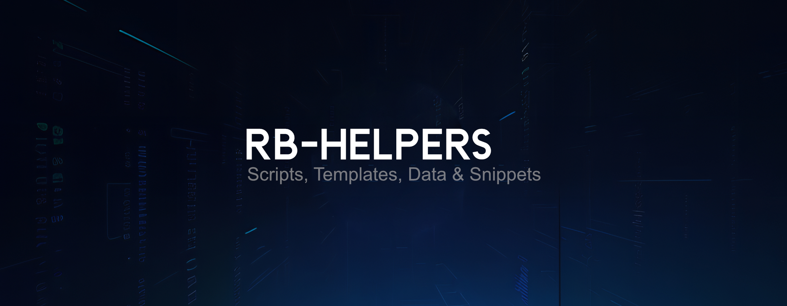

    
     
     
    <i>
    a list of various scripts, examples, packages and docs that help me do stuff
    </i>
     
     
    
    

 
 

# Scripts
- `time_display.py` - cli program to display datetimes for multiple regions and formats
- `yt_feed.py` - cli program to scrapes youtube for details about a list of channels

 
 

# Templates
- `py_proc` - a class to handle subprocess across platforms
- `py_typer_cli.py` - simple typer cli template
- `md_readme.md` - template for repo readme